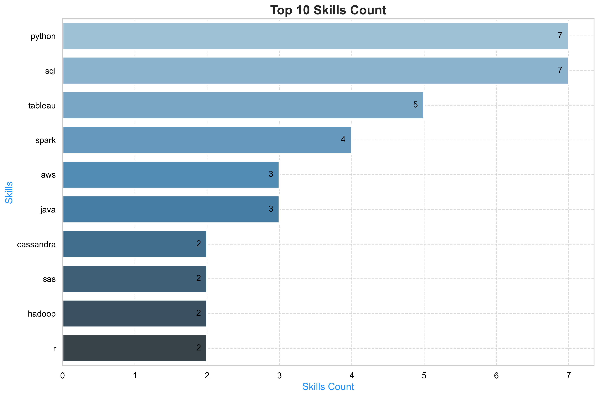

# Introduction
This project dives into the data job market, focusing on Data Scientist roles. It explores how paying jobs, in-demand skills and where high demand meets high salary in data science.

SQL queries here: [project_sql](/project_sql/)

# Tools I used
- **SQL**: Used to query the database and extract insights.
- **PostgresSQL**: THe database management system chosen for this project.
- **Visual Studio Code**: Where I manage the database and executed SQL queries
- **Git and Github**: For version control and project sharing


# The Analysis

### 1. Top paying Data Scientist Jobs

To find the top 10 highest-paying Data Scientist positions (technical positions, excluding manaferial and executive roles), the following sql code was used:

```sql
SELECT
    job_id,
    job_title,
    job_location,
    job_schedule_type,
    salary_year_avg,
    job_posted_date,
    company_dim.name AS company_name
FROM 
    job_postings_fact
LEFT JOIN company_dim ON job_postings_fact.company_id = company_dim.company_id
WHERE
    job_title_short = 'Data Scientist'
    AND salary_year_avg IS NOT NULL
    AND job_location = 'Anywhere' 
    AND job_title NOT LIKE '%Director%'
    AND job_title NOT LIKE '%Head%' 
    AND job_title NOT LIKE '%Principal%'
    AND job_title NOT LIKE '%Chief%'
    AND job_title NOT LIKE '%President%'
    AND job_title NOT LIKE '%Manager%'
ORDER BY
    salary_year_avg DESC
LIMIT 10;
```
- Top 10 Salary Range: Data Scientist techniocal roles pays from $247k to $550k

- Specialization Pays: Roles in specific fields such as quantitative research and machine learning for ads measurement offer significantly higher salaries, indicating that specialized expertise can be highly lucrative.

### 2. Top paying Data Scientist Skills


```sql
WITH top_paying_jobs AS 
(
-- code used in first query
)

SELECT 
    skills_dim.skills,
    COUNT(*) AS skills_count,
    ROUND(AVG(top_paying_jobs.salary_year_avg), 0) AS avg_salary
FROM top_paying_jobs
INNER JOIN skills_job_dim ON top_paying_jobs.job_id = skills_job_dim.job_id
INNER JOIN skills_dim ON skills_job_dim.skill_id = skills_dim.skill_id
GROUP BY
    skills
ORDER BY
    skills_count DESC
```
The most demanded skills for the top 10 hihest paying data scientist jobs in 2023:



### 3.Top In-Demand Skills for Remote Data Scientist Roles 

```sql
WITH filtered_jobs AS (
    SELECT DISTINCT job_postings_fact.job_id
    FROM job_postings_fact
    INNER JOIN skills_job_dim ON job_postings_fact.job_id = skills_job_dim.job_id
    INNER JOIN skills_dim ON skills_job_dim.skill_id = skills_dim.skill_id
    WHERE job_title_short = 'Data Scientist'
    AND job_work_from_home IS TRUE
    AND job_title NOT LIKE '%Director%'
    AND job_title NOT LIKE '%Head%'
    AND job_title NOT LIKE '%Principal%'
    AND job_title NOT LIKE '%Chief%'
    AND job_title NOT LIKE '%President%'
    AND job_title NOT LIKE '%Manager%'
),
total_jobs AS (
    SELECT COUNT(*) AS total_jobs FROM filtered_jobs
)

SELECT 
    skills_dim.skills,
    COUNT(skills_job_dim.job_id) AS demand_count,
    ROUND(
        COUNT(DISTINCT skills_job_dim.job_id) * 1.0 / (SELECT total_jobs FROM total_jobs), 2
    ) AS perc_jobs
FROM filtered_jobs
INNER JOIN skills_job_dim ON filtered_jobs.job_id = skills_job_dim.job_id
INNER JOIN skills_dim ON skills_job_dim.skill_id = skills_dim.skill_id
GROUP BY skills_dim.skills
ORDER BY demand_count DESC
LIMIT 5;
```

Based on an analysis of job postings for remote **Data Scientist** roles (excluding senior positions like Director, Manager, etc.), here are the top required skills:

| 🏆 Rank | 🛠️ Skill  | 📈 Job Postings Count | 📊 % of Total Jobs |
|---------|----------|---------------------|------------------|
| 1️⃣ | **Python** | 9,560 | **81%** |
| 2️⃣ | **SQL** | 6,901 | **58%** |
| 3️⃣ | **R** | 4,268 | **36%** |
| 4️⃣ | **AWS** | 2,325 | **20%** |
| 5️⃣ | **Tableau** | 2,258 | **19%** |

- **Python & SQL** are essential, appearing in over **50%** of job postings.  
- **Cloud skills (AWS)** are gaining traction, reflecting the industry's shift toward - **cloud-based analytics**.  
- **Data visualization (Tableau)** remains a crucial skill for effective **data storytelling**.  

## 4. **Top High-Paying & In-Demand Skills for Data Scientists**  

```sql
SELECT 
    skills_dim.skill_id,
    skills_dim.skills AS skills,
    COUNT(skills_job_dim.job_id) AS demand_count,
    ROUND(AVG(salary_year_avg), 0) AS avg_salary
FROM job_postings_fact
INNER JOIN skills_job_dim ON job_postings_fact.job_id = skills_job_dim.job_id
INNER JOIN skills_dim ON skills_job_dim.skill_id = skills_dim.skill_id
WHERE
    salary_year_avg IS NOT NULL 
    AND job_title_short = 'Data Scientist'
    AND job_work_from_home IS TRUE
    AND job_title NOT LIKE '%Director%'
    AND job_title NOT LIKE '%Head%'
    AND job_title NOT LIKE '%Principal%'
    AND job_title NOT LIKE '%Chief%'
    AND job_title NOT LIKE '%President%'
    AND job_title NOT LIKE '%Manager%'
GROUP BY
    skills_dim.skill_id
HAVING
    COUNT(skills_job_dim.job_id) > 20
ORDER BY
    demand_count DESC,
    avg_salary DESC
LIMIT 25;
```

Based on job market trends, these are the **most valuable skills** to focus on:  

|  **Skill**       |  **Demand Count** |  **Avg Salary (annual)** |
|-------------------|-------------------|-----------------------|
| Python           | 659               | $136,834             |
| SQL             | 520               | $137,428             |
| Spark            | 120               | $141,572             |
| AWS              | 169               | $138,506             |
| Tableau          | 192               | $140,346             |
| TensorFlow       | 102               | $139,072             |
| PyTorch         | 92                | $139,147             |
| Scikit-Learn     | 68                | $135,986             |
| Snowflake        | 65                | $149,999             |
| BigQuery         | 31                | $150,633             |

**🔥 Cloud & Big Data are in high demand!**  
- AWS , Snowflake , and BigQuery** are crucial skills.  

**💡 Mastering SQL & Python is non-negotiable.**  
- **Python** and **SQL** are essential for all data science roles.  
- These skills have the highest **job demand** and solid salaries.  

**📊 Data Visualization & Analytics Skills Are Valuable.**  
**Tableau (192 jobs, $140K salary)** and **Looker (48 jobs, $154K salary)** are sought after.  
- Having strong **BI skills** can differentiate you.  

**Machine Learning** is lucrative, but pairing it with Cloud is key.
- **TensorFlow** ($139K),**PyTorch** ($139K), and **Scikit-Learn** ($135K) show strong ML demand.  
- integrating ML with Cloud (AWS, GCP, Azure) makes you even more competitive.**  